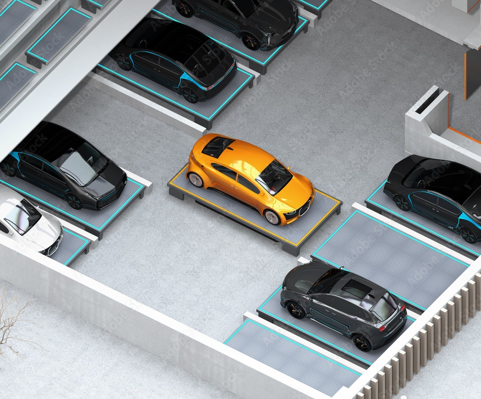

## Description
Aiming at the inefficiency and even deadlock deficiencies faced by AGVs, this project proposes an integrated AGV scheduling and cooperative operation method based on deep reinforcement learning (DRL),
achieving safe, efficient and cooperative operation performance of AGVs.

## Highlights
+ A hierarchical cooperative operation approach based on a bi-level architecture is proposed for AGV based AVP system.↳

+ Deep reinforcement learning is used to allocate parking spaces and improve the AVP system’s efficiency. 

+ Planning based cooperative driving approach is modified to realize collision-free and deadlock-free moving of multiple AGVs in conflict scenarios.

+ A deadlock detection-and-recovery approach is proposed to solve the potential circle deadlock of multiple AGVs.

### Architecture


---


## Related Papers
+ [A Bi-level Cooperative Operation Approach for AGV based Automated Valet Parking](https://jiaweizhang.netlify.app/publication/a-bi-level-cooperative-operation-approach-for-agv-based-automated-valet-parking/)

## Citation
If you find our work is useful in your research, please consider citing:


```
@article{zhang2021bi,
  title={A bi-level cooperative operation approach for AGV based automated valet parking},
  author={Zhang, Jiawei and Li, Zhiheng and Li, Li and Li, Yidong and Dong, Hairong},
  journal={Transportation Research Part C: Emerging Technologies},
  volume={128},
  pages={103140},
  year={2021},
  publisher={Elsevier}
}
```
