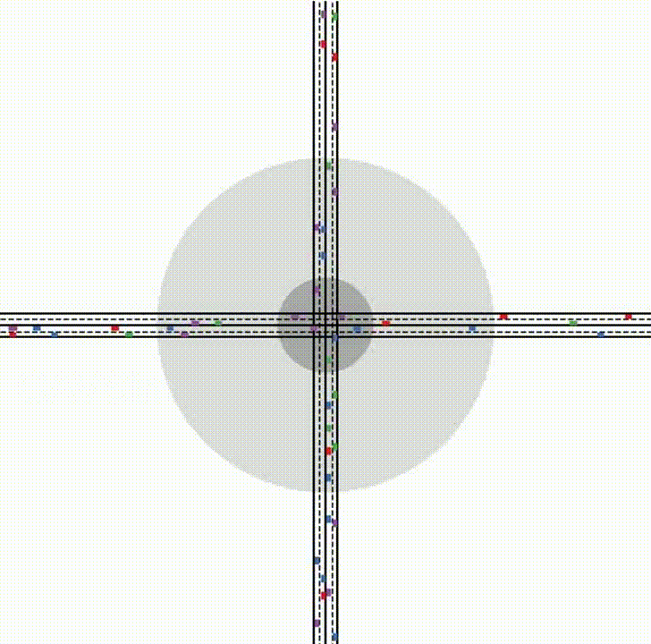

[CAVSim](https://github.com/JiaweiZhang-THU/CAVSim) is a microscopic traffic simulator for the CAV environment. The framework of CAVSim is consistent with the realistic CAV environment, including module decomposition, road segmentation, computing task allocation, which can be conveniently used to deploy and test the cooperative driving methods at different levels about CAVs. Meanwhile, CAVSim emphasizes the critical properties and driving behaviors of CAVs and is dedicated to capturing the characteristics of CAVs and their impact on traffic flow. Modular development makes CAVSim have good scalability, which can simulate typical local traffic scenarios, and can also simulate large-scale network-wide traffic through reasonable splicing of road blocks. With CAVSim, users can conduct various traffic and vehicle simulations related to CAVs. Finally, CAVSim is an evolving project, and we will further refine and enhance it next. In particular, we will develop more benchmarking algorithms in CAVSim to promote the development of CAV with a unified platform.

## The overall framework of CAVSim.


---
#### **Lane Change at Straight Lane**


---
#### **Cooperative Driving at Signal-free Intersections**




---
#### **Multi-Vehicle Merging at On-ramps**


---
#### **Simulation of Road Network Traffic**


---

  
## Citation
If you find our work is useful in your research, please consider citing:

+ [CAVSim: A Microscopic Traffic Simulator for Evaluation of Connected and Automated Vehicles](https://jiaweizhang.netlify.app/publication/cavsim-a-microscopic-traffic-simulator-for-evaluation-of-connected-and-automated-vehicles/)
```
@ARTICLE{Zhang2023CAVSim,
  title={CAVSim: A Microscopic Traffic Simulator for Evaluation of Connected and Automated Vehicles},
  author={Zhang, Jiawei and Chang, Cheng and He, Zimin and Zhong, Wenqin and Yao, Danya and Li, Shen and Li, Li},
  journal={IEEE Transactions on Intelligent Transportation Systems},
  year={2023},
  pages={1-17},
  doi={10.1109/TITS.2023.3273565},
  publisher={IEEE}
}
```
+ [CAVSim: A Microscope Traffic Simulator for Connected and Automated Vehicles Environment](https://jiaweizhang.netlify.app/publication/cavsim-a-microscope-traffic-simulator-for-connected-and-automated-vehicles-environment/)
```
@INPROCEEDINGS{Zhang2022CAVSim,
  author={Zhang, Jiawei and Chang, Cheng and Pei, Huaxin and Peng, Xinyu and Guo, Yuqing and Lian, Renzong and Chen, Zhenwu and Li, Li},
  booktitle={2022 IEEE 25th International Conference on Intelligent Transportation Systems (ITSC)}, 
  title={CAVSim: A Microscope Traffic Simulator for Connected and Automated Vehicles Environment}, 
  year={2022},
  pages={3719-3724},
  doi={10.1109/ITSC55140.2022.9922267},
  publisher={IEEE}
}
```
