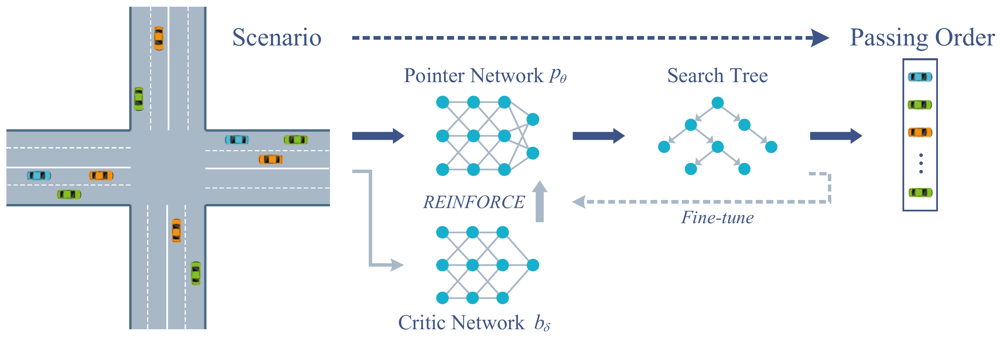
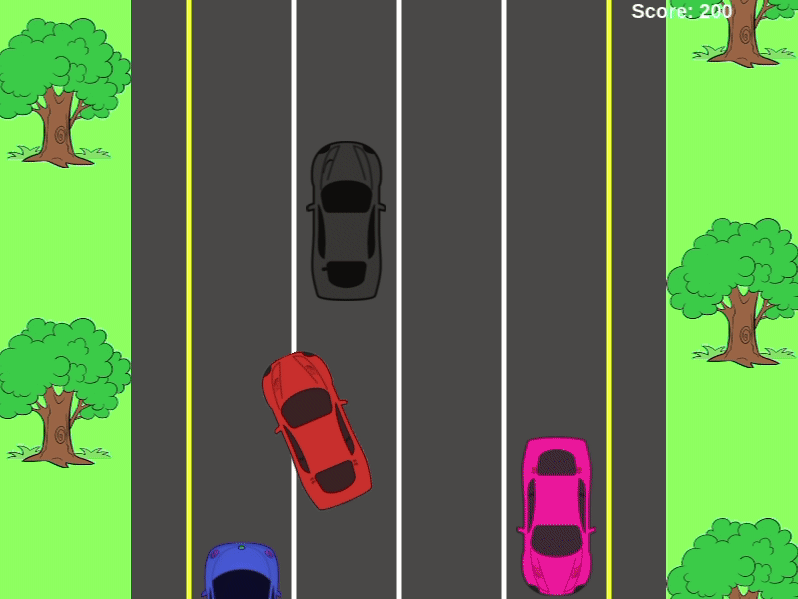
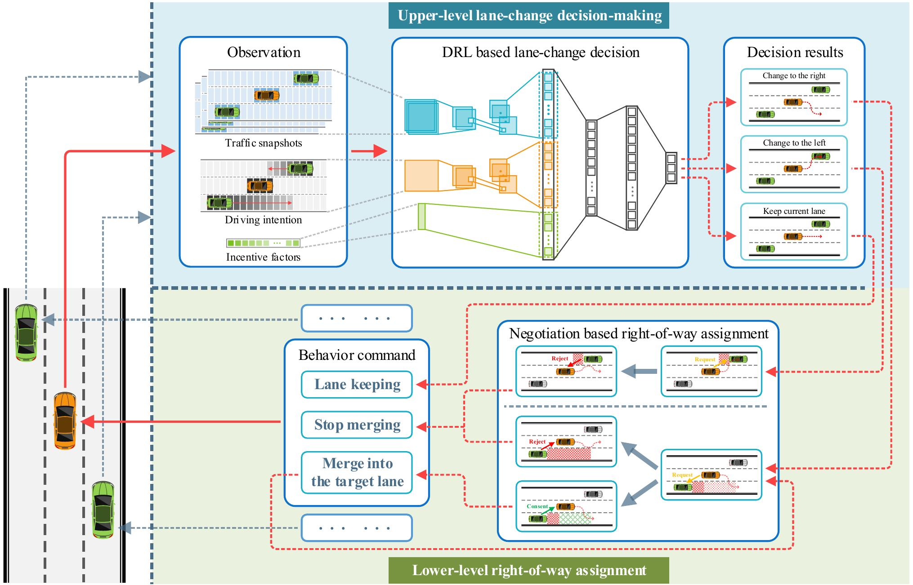
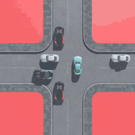
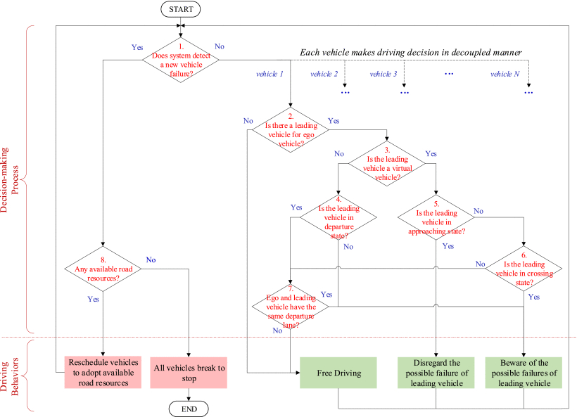

# Building ...

## This project involves the following system components:

+ ### Cooperative Driving at Intersection with Deep Learning Model

  

  

  + Paper: [Coordinating CAV Swarms at Intersections with A Deep Learning Model](https://jiaweizhang.netlify.app/publication/coordinating-cav-swarms-at-intersections-with-a-deep-learning-model/)
  
    

---

+ ### Multi-agent DRL based Lane-Change

  

  + Paper: [Multi-Agent DRL-based Lane Change with Right-of-Way Collaboration Awareness](https://jiaweizhang.netlify.app/publication/multi-agent-drl-based-lane-change-with-right-of-way-collaboration-awareness/)

    

---

+ ### Fault-tolerant cooperative driving at signal-free intersections

  

  + Paper: [Fault-tolerant cooperative driving at signal-free intersections](https://jiaweizhang.netlify.app/publication/fault-tolerant-cooperative-driving-at-signal-free-intersections/)

    
