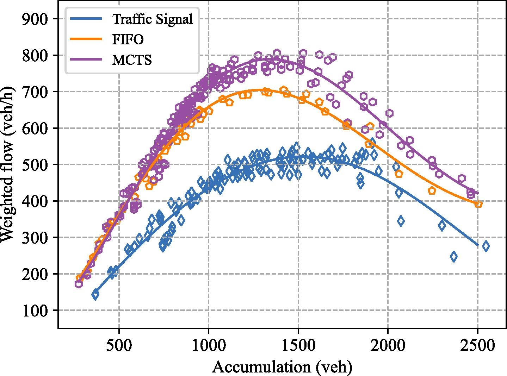

## Description
This project is the first to analyze and study the mechanistic characteristics of CAV swarms at the road network level, and we introduce a new performance metric: the macroscopic fundamental diagram (MFD).

##  Innovation
This project proposes the mechanistic characteristics of AV swarms: the microscopic self-organized driving behaviors of AVs lead to significant performance differences in the macroscopic system level, with the right-of-way conflicts playing a dominant role.

## Highlights
+ This project investigates the key ways for automated vehicles (AVs) to improve the traffic efficiency of two-dimensional urban network traffic.
+ Different cooperative driving strategies are investigated in a systematic and comprehensive way, and we find that the passing order has a dominant impact on the network traffic efficiency.
+ This project compares the differences and characteristics of the impact of the passing orders and the car-following gaps on the urban network traffic.
+ By using the macroscopic fundamental diagram (MFD) as the performance metric, we find that a better passing order can broaden the free flow region and improve the maximum flow, which is of great benefit to the network traffic efficiency.


### Performance Metric


#### MFDs of the network traffic under different control strategies.



---

## Related Papers
+ [Analysis of Cooperative Driving Strategies at Road Network Level with Macroscopic Fundamental Diagram](https://jiaweizhang.netlify.app/publication/analysis-of-cooperative-driving-strategies-at-road-network-level-with-macroscopic-fundamental-diagram/)

## Citation

If you find our work is useful in your research, please consider citing:

```
@article{ZHANG2022103503,
  title = {Analysis of cooperative driving strategies at road network level with macroscopic fundamental diagram},
  journal = {Transportation Research Part C: Emerging Technologies},
  volume = {135},
  pages = {103503},
  year = {2022},
  issn = {0968-090X},
  doi = {https://doi.org/10.1016/j.trc.2021.103503},
  url = {https://www.sciencedirect.com/science/article/pii/S0968090X21004897},
  author = {Jiawei Zhang and Huaxin Pei and Xuegang (Jeff) Ban and Li Li},
  keywords = {Cooperative driving, Network traffic, Passing order, Macroscopic fundamental diagram (MFD)}
}
```
