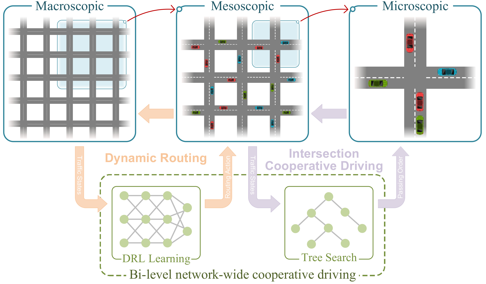
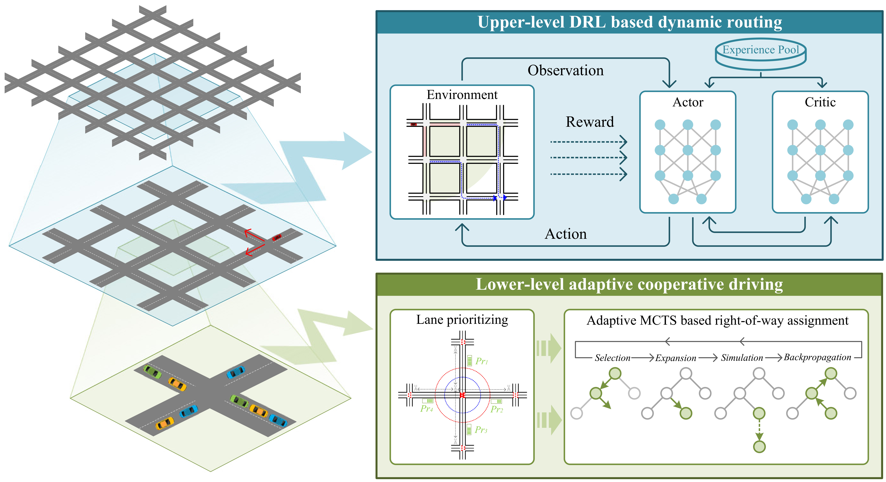
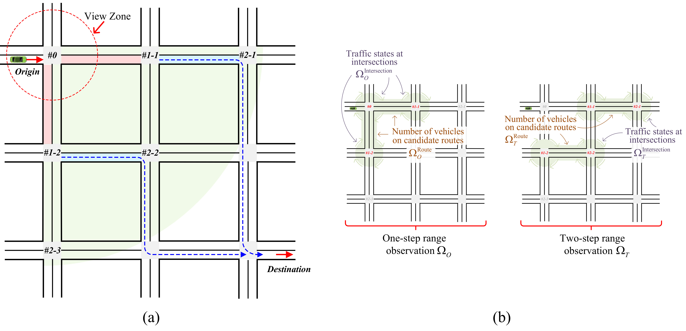
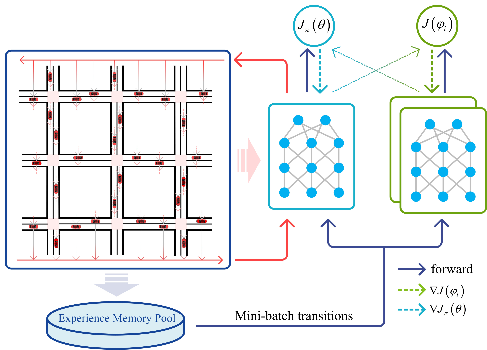
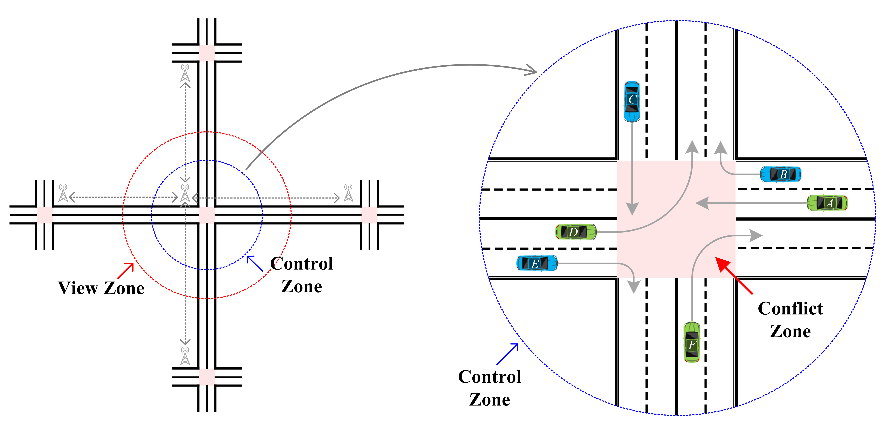
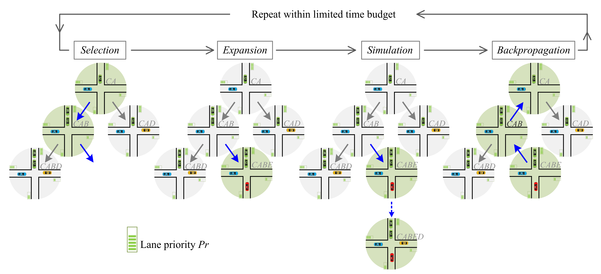

## The bi-level network-wide cooperative driving approach.
### An illustration of the proposed bi-level network-wide cooperative driving approach. In the upper level, the multi-agent deep reinforcement learning (DRL) based dynamic routing model takes the traffic state information from the macroscopic system as input and outputs the mesoscopic routing choices. In the lower level, the tree search based intersection cooperative driving algorithm takes the traffic state information from the mesoscopic system as input and outputs the microscopic passing order, i.e., the right-of-way assignment of vehicles passing through the conflict areas.


---
### The overall framework of the bi-level network-wide cooperative driving approach for CAV swarms.


---
## The dynamic routing problem formulation and corresponding reinforcement learning setup. 
#### （*a*） An illustration of the routing problem formulation. The red-shaded lanes are the candidate routes, and the blue-shaded lanes are the subsequent lanes corresponding to the two candidate routes. The traffic state information on the green-shaded area is the critical basis for dynamic routing decisions. The blue-dotted routes indicate the shortest subsequent routes for the candidate routes to the destination.
#### （*b*） Observation Space, where the left subfigure is one-step range observation and the right subfigure is two-step range observation. Furthermore, for ease of reading, it is necessary to illustrate the intersection markers. For example,*Node \# 1-2* refers to the second intersection that is one step away from the current node. And so on for the rest.



---
## An illustration of the training pipeline of the upper-level multi-agent DRL based routing model. 


---
## An illustration of the adaptive MCTS based cooperative driving algorithm.
#### (*left*) Queuing length information in the view zone (obtained by the roadside units at the current intersection) and drive-in traffic flow rate information of each lane (obtained by roadside units at the adjacent intersections and V2X communication) will be used to solve for the passing order of vehicles within the control zone (indicated by the blue dashed line).
#### (*right*) An illustration of the passing order. For example, "*BDEFCA*" is a feasible passing order. When the routes of two vehicles conflict, the more front the vehicle is in the passing order, the higher its priority is. For example, the priority of \emph{Vehicle D} is higher than the priority of *Vehicle A*.


---
## The performance of AlphaOrder versus other algorithms on scenarios with different numbers of vehicles.



## Citation
If you find our work is useful in your research, please consider citing:
```
@ARTICLE{10221733,
  author={Zhang, Jiawei and Ge, Jingwei and Li, Shu and Li, Shen and Li, Li},
  journal={IEEE Transactions on Intelligent Vehicles}, 
  title={A Bi-level Network-wide Cooperative Driving Approach Including Deep Reinforcement Learning-based Routing}, 
  year={2023},
  volume={},
  number={},
  pages={1-17},
  doi={10.1109/TIV.2023.3305818}
}
```

