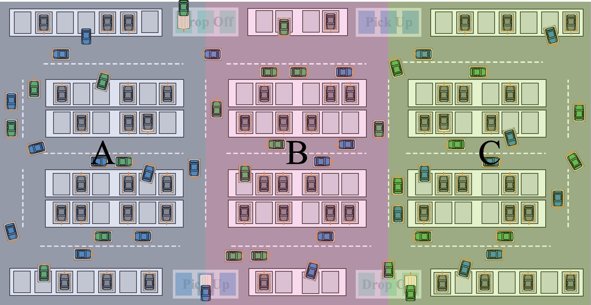
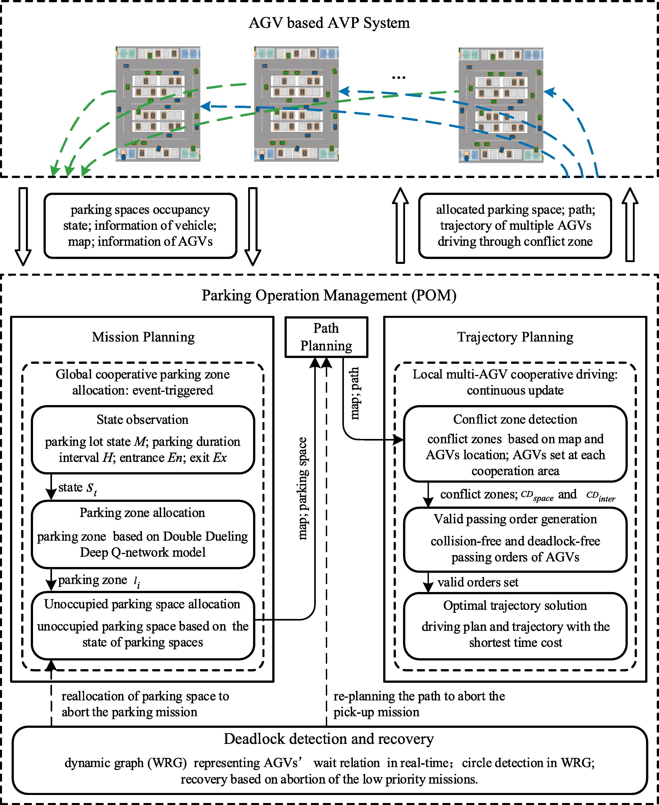
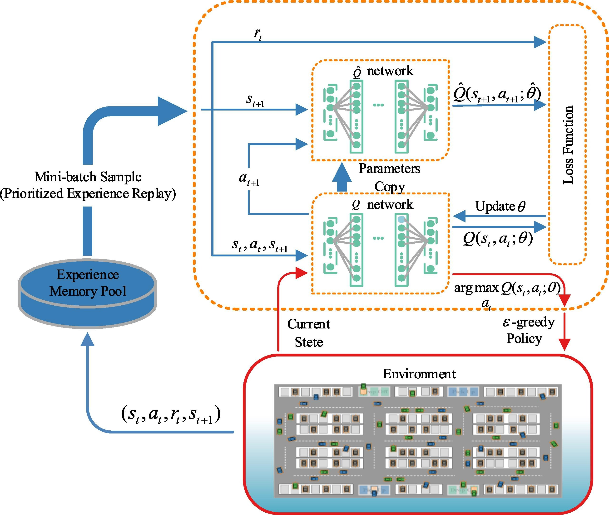

## AGV based Parking System


## Architecture


## DRL based Parking Space Allocation
#### The architecture of the DRL model for cooperative parking space allocation.


## Citation
If you find our work is useful in your research, please consider citing:
```
@article{zhang2021bi,
  title={A bi-level cooperative operation approach for AGV based automated valet parking},
  author={Zhang, Jiawei and Li, Zhiheng and Li, Li and Li, Yidong and Dong, Hairong},
  journal={Transportation Research Part C: Emerging Technologies},
  volume={128},
  pages={103140},
  year={2021},
  publisher={Elsevier}
}
```

