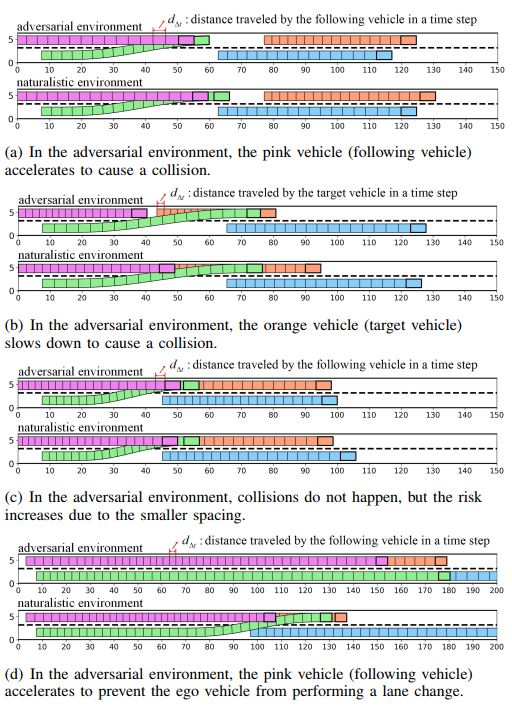

 *下面为本研究的简介，详细内容请参阅[论文](https://ieeexplore.ieee.org/document/10422684)原文*



---


## Citation
If you find our work is useful in your research, please consider citing:
```
@INPROCEEDINGS{10422684,
  author={He, Zimin and Zhang, Jiawei and Yao, Danya and Zhang, Yi and Pei, Huaxin},
  booktitle={2023 IEEE 26th International Conference on Intelligent Transportation Systems (ITSC)}, 
  title={Adversarial Generation of Safety-Critical Lane-Change Scenarios for Autonomous Vehicles}, 
  year={2023},
  volume={},
  number={},
  pages={6096-6101},
  keywords={Deep learning;Performance evaluation;Simulation;Reinforcement learning;Safety;Autonomous vehicles;Testing},
  doi={10.1109/ITSC57777.2023.10422684}}
```

