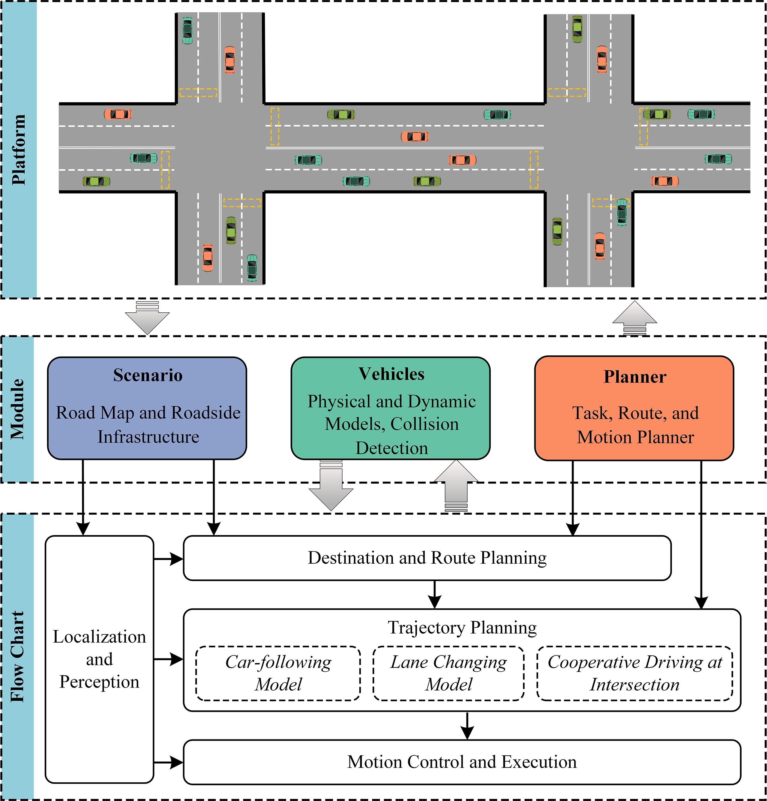
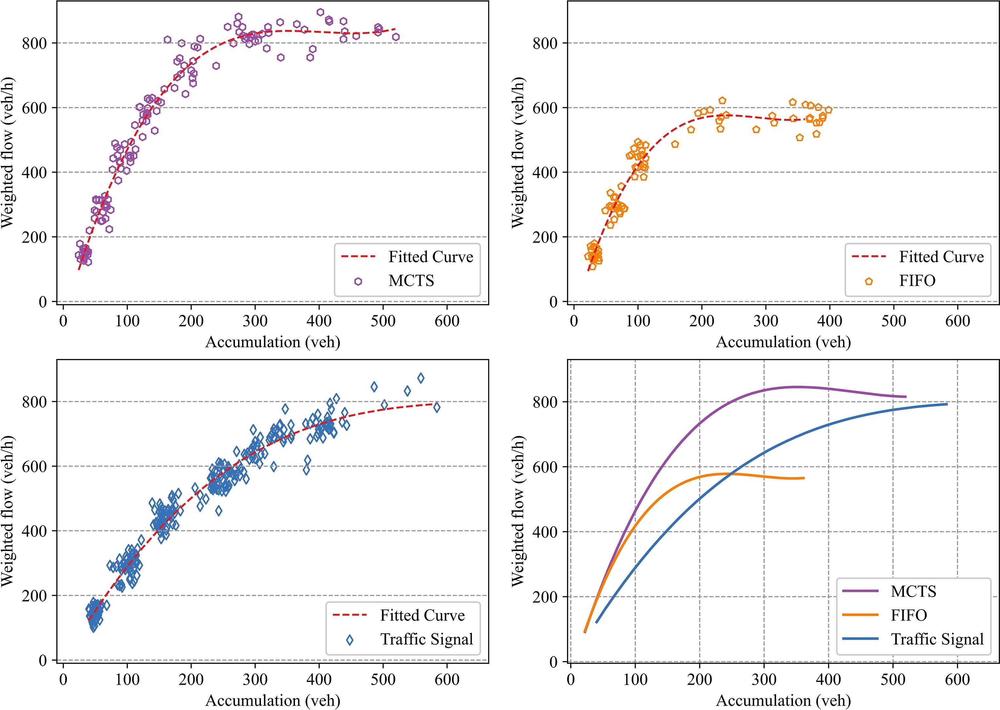
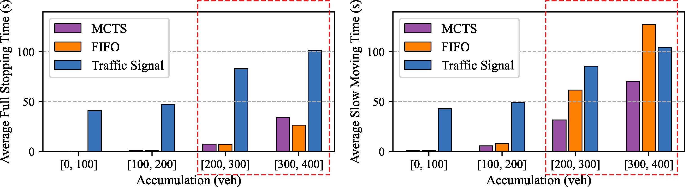
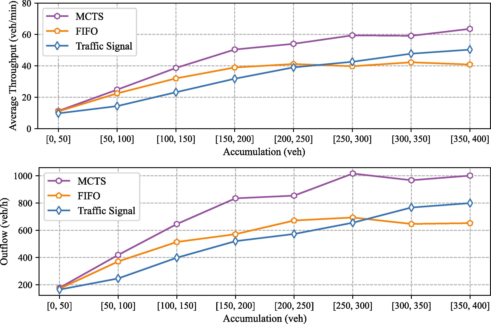
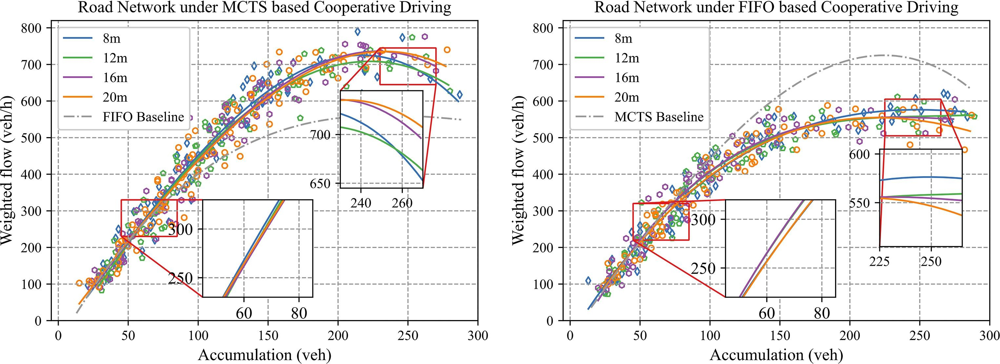
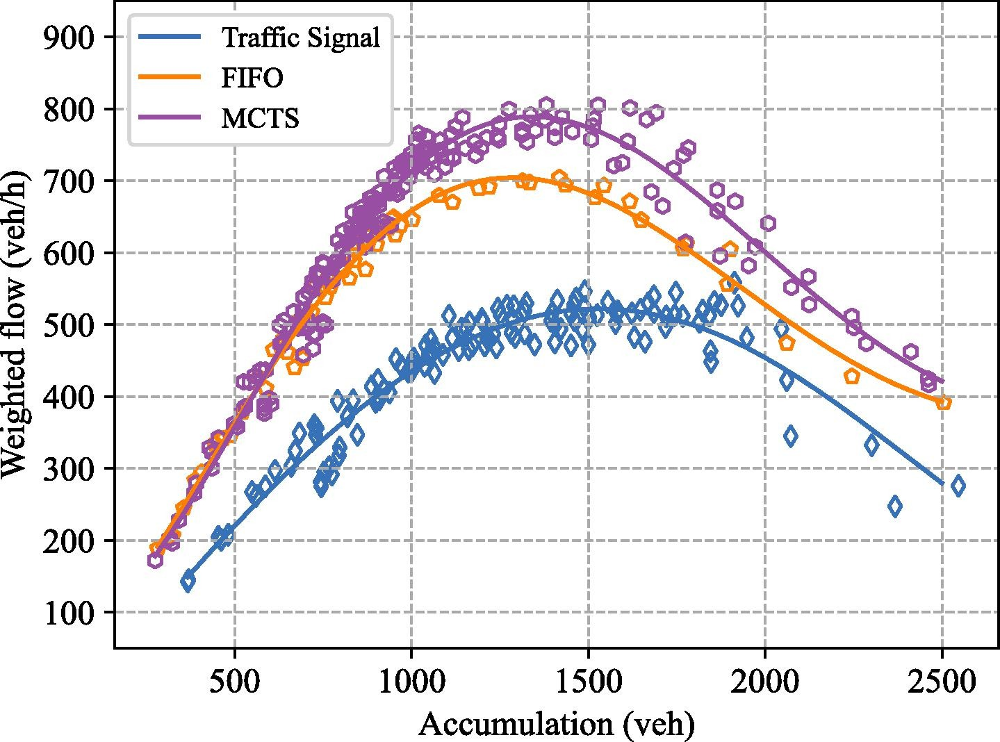

## Overview of the simulation platform.


---
#### MFDs of the network traffic under different control strategies.


---
#### Average stopping time for different vehicle accumulations with different intersection control strategies. The left subfigure shows the average time of full stopping of the vehicles; the right shows the average time when the vehicle speed is less than *2m/s*, i.e., slow-moving.


---
####  The intersection throughput and network-wide outflow under different control strategies. The throughput in the upper subfigure is the average number of vehicles passing through a single intersection per minute, and the outflow in the lower subfigure is the average traffic flow at the network exit links.


---
#### The MFDs of network traffic with different car-following headway settings. The left subfigure corresponds to the MCTS based cooperative driving strategy, and the right subfigure corresponds to the FIFO based cooperative driving strategy. The FIFO baseline in the left subfigure is the average of the four FIFO curves in the right subfigure, and the MCTS baseline in the right subfigure is the average of the four MCTS curves in the left subfigure.


---
####  MFDs of the traffic network with twenty-five intersections under different control strategies.



## Citation
If you find our work is useful in your research, please consider citing:
```
@article{ZHANG2022103503,
  title = {Analysis of cooperative driving strategies at road network level with macroscopic fundamental diagram},
  journal = {Transportation Research Part C: Emerging Technologies},
  volume = {135},
  pages = {103503},
  year = {2022},
  issn = {0968-090X},
  doi = {https://doi.org/10.1016/j.trc.2021.103503},
  url = {https://www.sciencedirect.com/science/article/pii/S0968090X21004897},
  author = {Jiawei Zhang and Huaxin Pei and Xuegang (Jeff) Ban and Li Li},
  keywords = {Cooperative driving, Network traffic, Passing order, Macroscopic fundamental diagram (MFD)}
}

```

