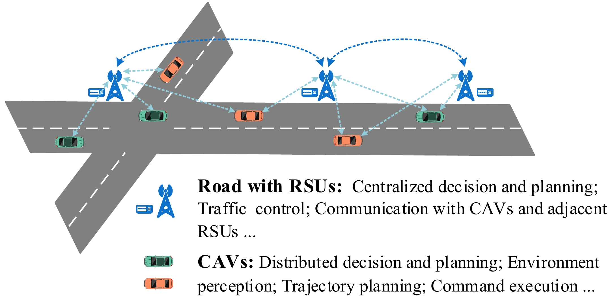
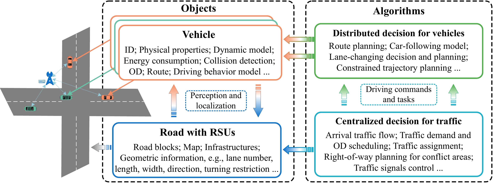
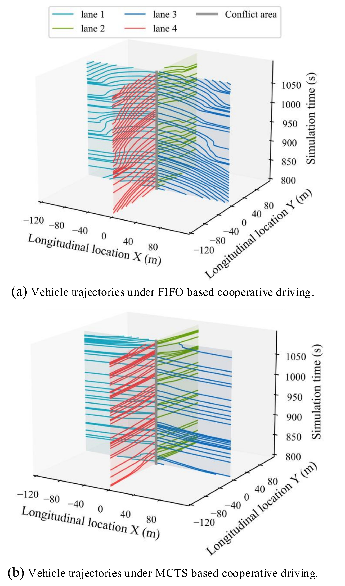

## CAVSim A Microscope Traffic Simulator for Connected and Automated Vehicles Environment.


---
## The overall framework of the CAVSim simulator.


---
##  Vehicle trajectories at signal-free intersection under different cooperative driving methods.
#### (a) Vehicle trajectories under FIFO based cooperative driving. (b) Vehicle trajectories under MCTS based cooperative driving.




## Citation
If you find our work is useful in your research, please consider citing:
```
@INPROCEEDINGS{9922267,
  author={Zhang, Jiawei and Chang, Cheng and Pei, Huaxin and Peng, Xinyu and Guo, Yuqing and Lian, Renzong and Chen, Zhenwu and Li, Li},
  booktitle={2022 IEEE 25th International Conference on Intelligent Transportation Systems (ITSC)}, 
  title={CAVSim: A Microscope Traffic Simulator for Connected and Automated Vehicles Environment}, 
  year={2022},
  volume={},
  number={},
  pages={3719-3724},
  doi={10.1109/ITSC55140.2022.9922267}
}

```

