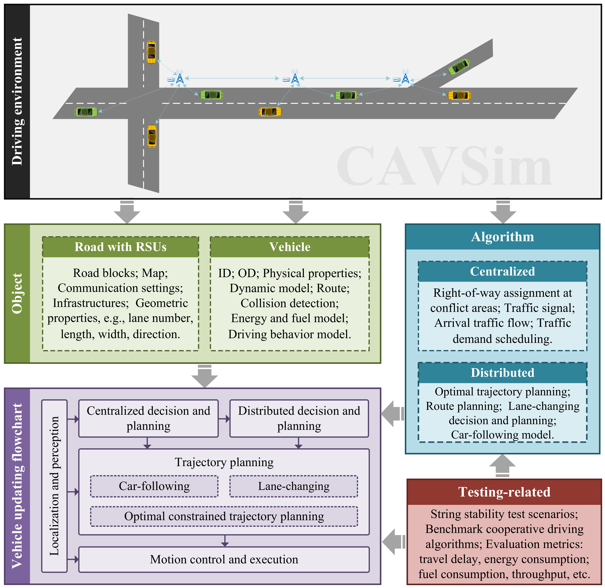
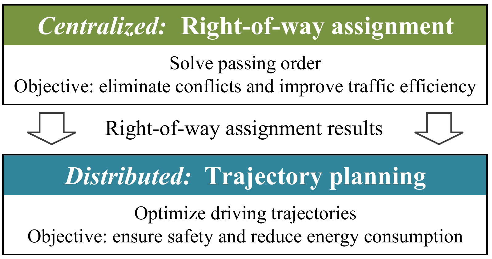
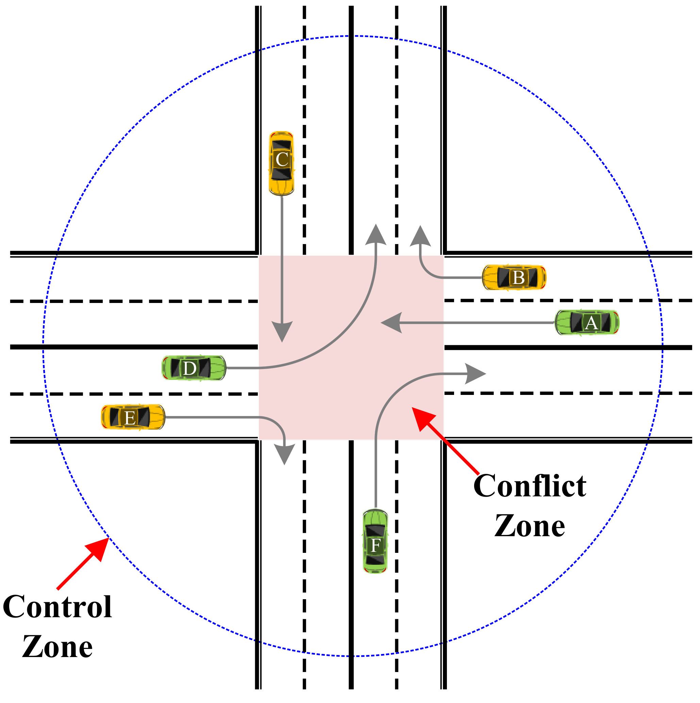
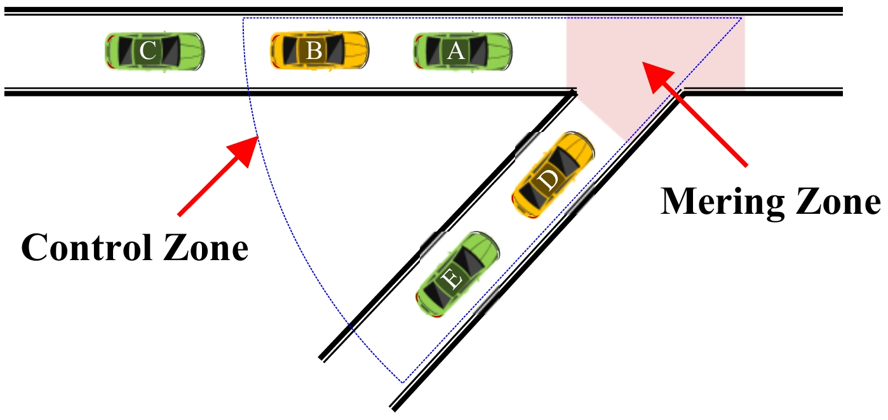
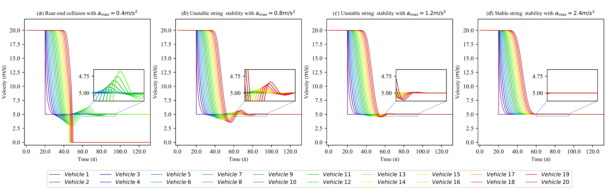

## The overall framework of CAVSim.


---
## The bi-level framework of cooperative driving for CAV swarms. 


---
##  A typical signal-free intersection. 
#### For example, “*BDEFCA*” is a feasible passing order. When the routes of two vehicles conflict, the more  front the vehicle is in the passing order, the higher its priority. For example, the priority of *Vehicle D* is higher than the priority of *Vehicle A*.



---
##  A typical on-ramp merging scenario for connected and automated vehicles.


---
## The velocities of a CAV platoon under different cruise settings in CAVSim.
#### We simulate the scenario that the speed of the leading vehicle (i.e., *Vehicle 1*) suddenly decelerates from *20m/s* to *5m/s* under different settings.


---
##  Vehicle trajectories at the on-ramp scenario under different cooperative driving algorithms.


## Citation
If you find our work is useful in your research, please consider citing:
```
@ARTICLE{10124078,
  author={Zhang, Jiawei and Chang, Cheng and He, Zimin and Zhong, Wenqin and Yao, Danya and Li, Shen and Li, Li},
  journal={IEEE Transactions on Intelligent Transportation Systems}, 
  title={CAVSim: A Microscopic Traffic Simulator for Evaluation of Connected and Automated Vehicles}, 
  year={2023},
  volume={},
  number={},
  pages={1-17},
  doi={10.1109/TITS.2023.3273565}
}
```

