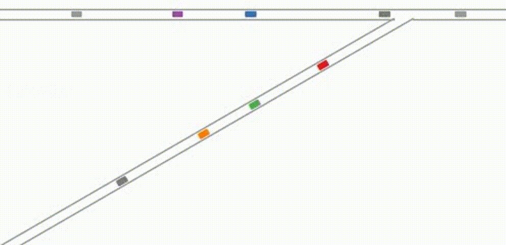

 *下面为本研究的简要介绍，详细内容请参阅[论文](https://ieeexplore.ieee.org/stamp/stamp.jsp?tp=&arnumber=10221733)原文*


**典型的智能网联汽车和自动驾驶汽车仿真环境**

---


**CAVSim的核心架构**. 基于模块化原理，设计了CAVSim的总体框架。CAVSim有三个核心组件：对象、算法和测试相关。首先，对象模块的元素，即道路和车辆，是用于构建仿真环境的主要组件，它们将频繁交互以模拟智能网联环境。其次，算法模块提供了有关交通和车辆的决策和规划方法。同时，算法模块专门提供各种接口，使研究人员可以通过改变某个接口来部署不同的算法，然后在CAVSim上进行微观自动驾驶仿真，以模拟和评估他们的方法。第三，测试相关模块提供了典型的标准化算法和可比较的性能指标。此外，紫色模块中的车辆更新流程图总结了CAVSim中车辆驾驶感知-决策-行动循环的主要步骤。

---


**对象模块——道路**. 道路是微观交通仿真环境的主要组成部分。在智能网联环境中，路测设备赋予道路丰富的角色和功能。为了增加CAVSim中交通场景的可扩展性，并考虑略侧设备的边缘性，我们基于典型的交通场景对道路进行分段，以获得基本的道路块，如图所示。3。

---


**前馈式决策规划示例**。在CAVSim中，自动驾驶车辆群体通过无信号交叉口的问题采用双层框架解决。在上层，集中式算法将冲突区域的通行权分配给控制区域中的车辆，而在下层，分布式轨迹规划算法基于集中式算法的输出以前馈模式规划车辆的运动。


---


**典型的无信号交叉口**。例如，“*BDEFCA*”是一个可行的通行顺序。当两辆车的路线冲突时，车辆在通过顺序中越靠前，其优先级就越高。例如，车辆*D*的优先级高于车辆*A*的优先级。

---


**典型的匝道合流区域**。自动驾驶车辆群体在匝道处合流是另一种典型的关键交通场景，其中智能网联技术将显著提高合流的安全性和效率。与无信号交叉口类似，匝道上的协同驾驶通常由双层框架解决。上层集中式算法解决了车辆的优先级关系，也可以称为通过顺序。下层分布式算法求解最优轨迹。

---


**CAVSim的测试功能示例——车队弦稳定性测试**. 串稳定性是指车辆在车队中任何位置的非零位置、速度或加速度波动的性能，这些波动在车队上游的传播中没有被放大，这是评估车队控制方法性能的核心指标。上图显示了CAVSim模拟器在不同车队巡航下获得的CAV车队的弦不稳定性和弦稳定性。特别是，图（a）显示，降低最大加速度以提高舒适度的设置可能会导致严重的不稳定性，导致上游车辆追尾。然而，目前没有一个模拟器提供自动的弦稳定性测试功能，大多数模拟器在模拟CAV车队的弦稳定行为方面存在不足。


---


**车队弦稳定性测试——信标发送频率（BSF）**. 在两轮通信之间，后车使用前车在上一轮通信中发送的信息来规划其运动。上图显示了车辆20在不同BSF下的速度。从结果中可以看出，BFS越高，即车辆从前一车辆获得信息的时间越长，将有助于提高车队的稳定性并减少上游车辆的速度下冲。然而，BFS对弦稳定性的改进是有限的。当BFS大于35Hz时，随着BSF的增加，车队的稳定性几乎不再提高。

---


**车队弦稳定性测试——最大加速度**.  使用CAVSim对不同最大加速度进行的稳稳定性测试结果上图所示。上图1显示了车辆20的速度变化。结果表明，随着最大加速度a_max的增加，车队的弦稳定性逐渐变好。当a_max≥1.2m/s^2时，车辆20的速度下冲减至0，即实现弦稳定性。上图2显示的车辆20的加速度变化也表明，增加最大加速度可以显著提高CAV排的弦稳定性。最大加速度越高，车辆20的反射时间就越短，恢复稳定性所需的时间也越短，即扰动的持续时间就越长。


---


**不同算法下车辆的轨迹**. 结果显示，当车流到达率较低时，基于蒙特卡洛树搜索的算法和基于动态规划的算法会协调部分个体车辆进行明显的减速以提高总体的效率，而绝大多数其他车辆的轨迹稳定平滑。相反，使用先进先出和改进的先进先出算法，许多车辆会减速，但减速幅度很小。这表明，当车辆较少时，为了提高整体效率，部分车辆需要做出牺牲，以便其他车辆能够更高效地通过十字路口。否则，许多车辆会减速。

---


**不同算法下车辆的轨迹**.结果显示了当车流到达率较大时的车辆轨迹。此时，在所有四种算法下都会出现由不同程度的拥堵引起的减速现象。其中，基于蒙特卡洛树搜索的算法具有较少的拥塞和较高的效率。另一方面，改进的基于FIFO的算法存在严重的拥塞。因此，如表I所示，它具有更高的延迟、能量消耗和燃料消耗。

---

表1： 无信号交叉口不同算法的基准结果


---


**公平性问题**. 然而，值得注意的是，提高整体效率可能会导致公平性差等缺陷。如表I中所列，在*380veh/h/lane*的到达速率下，基于MCTS的算法实现了比基于FIFO的算法更短的平均延迟，即更高的交通效率。然而，上图所示的结果表明，基于MCTS的算法将导致一些车辆的行驶时间较长。相反，尽管FIFO的平均延迟很大，但车辆之间的公平性更好。因此，我们认为，好的路权分配应该更好地平衡全局交通效率和个体效率，这仍然是无信号交叉口协同驾驶需要继续探索的课题。

---


**匝道基准结果**. 为了直观地展示不同匝道合流算法的特点，我们绘制了不同算法控制的车辆在拥堵交通条件下的时空轨迹，结果如上图所示。结果表明，基于分组、基于动态规划和基于规则的算法通常具有更高的效率和更低的能耗，可以以分组的方式引导同一车道上的车辆通过合流区。这表明，通过调整一些车辆的运动，可以显著降低通过冲突区的平均延迟和能耗。更重要的是，更好的通行顺序往往具有分组的形式。相反，基于FIFO的算法通常根据先到先得的原则分配路权。主干道和匝道上的车辆依次驶过冲突区，导致后续车辆明显减速，拥堵波有逐渐向上游扩散的风险。

---

表2： 匝道合流场景下不同算法的基准结果


---


基于FIFO的算法和基于MCTS的算法下，路网的宏观基本图结果。


---
**仿真视频**

+ 无信号交叉口


+ 高速路强交互换道环境


+ 匝道合流


+ 大规模路网


## Citation
If you find our work is useful in your research, please consider citing:
```
@ARTICLE{10124078,
  author={Zhang, Jiawei and Chang, Cheng and He, Zimin and Zhong, Wenqin and Yao, Danya and Li, Shen and Li, Li},
  journal={IEEE Transactions on Intelligent Transportation Systems}, 
  title={CAVSim: A Microscopic Traffic Simulator for Evaluation of Connected and Automated Vehicles}, 
  year={2023},
  volume={24},
  number={9},
  pages={10038-10054},
  doi={10.1109/TITS.2023.3273565}}
```

```
@INPROCEEDINGS{9922267,
  author={Zhang, Jiawei and Chang, Cheng and Pei, Huaxin and Peng, Xinyu and Guo, Yuqing and Lian, Renzong and Chen, Zhenwu and Li, Li},
  booktitle={2022 IEEE 25th International Conference on Intelligent Transportation Systems (ITSC)}, 
  title={CAVSim: A Microscope Traffic Simulator for Connected and Automated Vehicles Environment}, 
  year={2022},
  volume={},
  number={},
  pages={3719-3724},
  doi={10.1109/ITSC55140.2022.9922267}}
```

