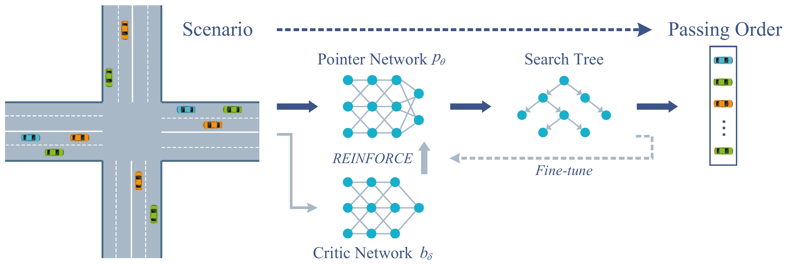
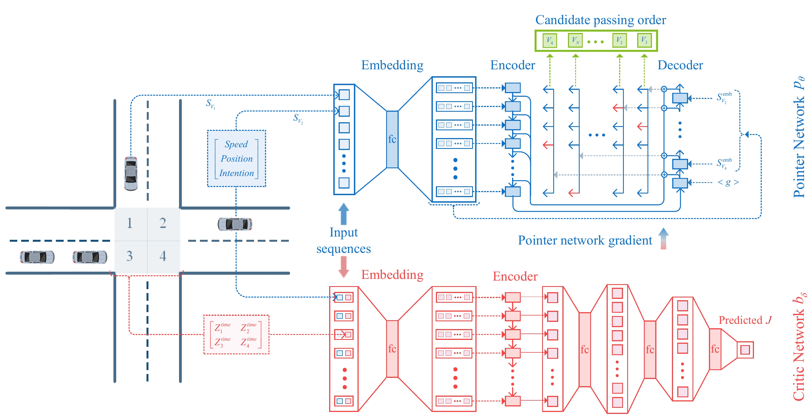
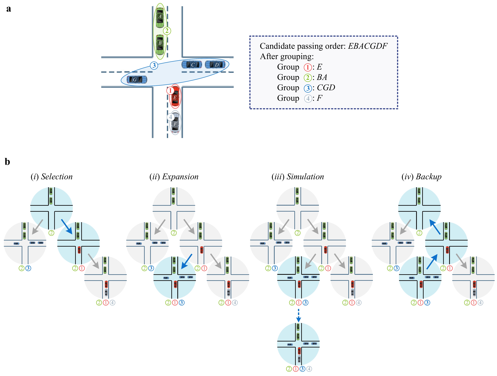
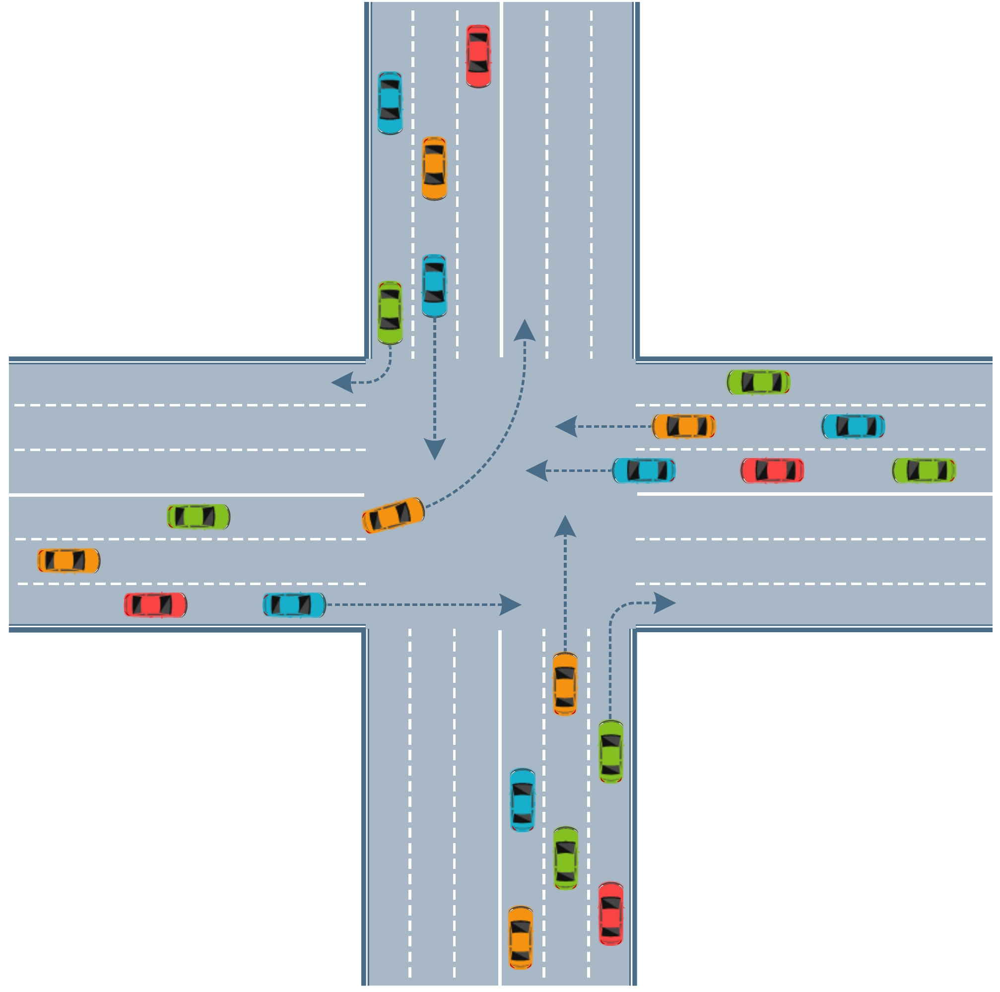
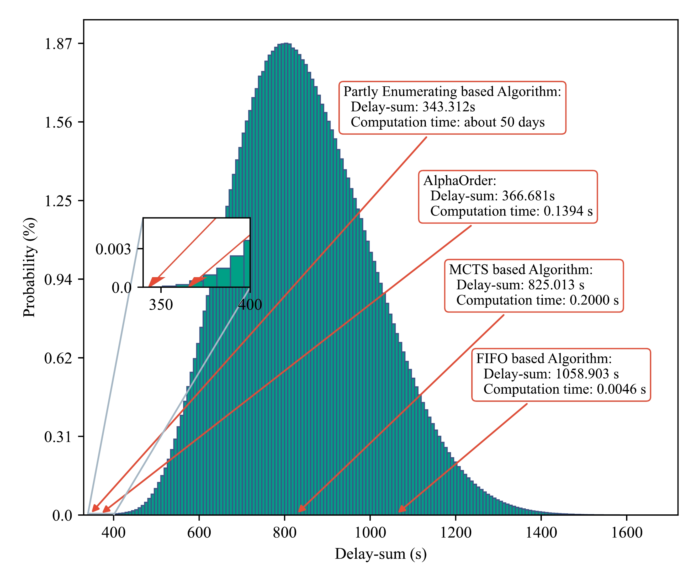
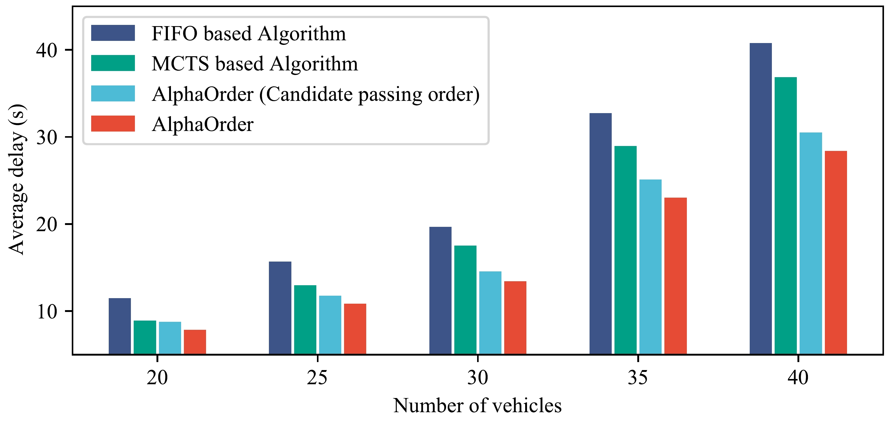

## Training and online solving pipeline of AlphaOrder.
### AlphaOrder takes vehicles within the intersection scenario as the input, and its output is the passing order of these vehicles passing through the intersection.


---
### Pointer and critic network architecture. 


---
## Grouping and Monte Carlo tree search in AlphaOrder. 
#### （*a*） Grouping: Vehicles that have adjacent positions in candidate passing order are bound together into one group. The search tree grows with groups as the basic units (instead of vehicles). 
#### （*b*） MCTS algorithm: (*i*) Selection: selecting the most promising nodes based on their scores; (*ii*) Expansion: expanding the not-yet-visited child node into the current search tree; (*iii*) Simulation: running several rollout simulations until a leaf node is reached, i.e., a complete passing order is obtained; (*iv*) Backup: back-propagating to update the scores of all parent nodes based on the score of the leaf node.



---
## A typical signal-free intersection with three lanes in each direction. 
#### In the experiments, we set the road with a length of *100m* from the conflict area as the control area (similarly hereinafter), and the vehicles within this range will be considered when coordinating the right-of-way. For safety reasons, vehicles in the control area are not allowed to change lanes.


---
#### The histogram of delays of different passing orders for a problem instance with 40 vehicles.


---
####  The performance of AlphaOrder versus other algorithms on scenarios with different numbers of vehicles.



## Citation
If you find our work is useful in your research, please consider citing:
```
@ARTICLE{10078727,
  author={Zhang, Jiawei and Li, Shen and Li, Li},
  journal={IEEE Transactions on Intelligent Transportation Systems}, 
  title={Coordinating CAV Swarms at Intersections With a Deep Learning Model}, 
  year={2023},
  volume={24},
  number={6},
  pages={6280-6291},
  doi={10.1109/TITS.2023.3250704}
}


```

