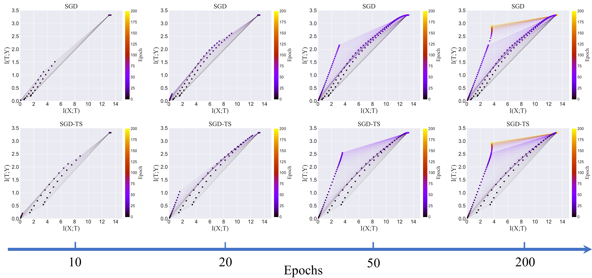

 *下面为本研究的简介，详细内容请参阅[论文](https://ieeexplore.ieee.org/abstract/document/9439803)原文*



## Citation
If you find our work is useful in your research, please consider citing:
```
@ARTICLE{9439803,
  author={Peng, Xinyu and Zhang, Jiawei and Wang, Fei-Yue and Li, Li},
  journal={IEEE Transactions on Neural Networks and Learning Systems}, 
  title={Drill the Cork of Information Bottleneck by Inputting the Most Important Data}, 
  year={2022},
  volume={33},
  number={11},
  pages={6360-6372},
  doi={10.1109/TNNLS.2021.3079112}
}
```

