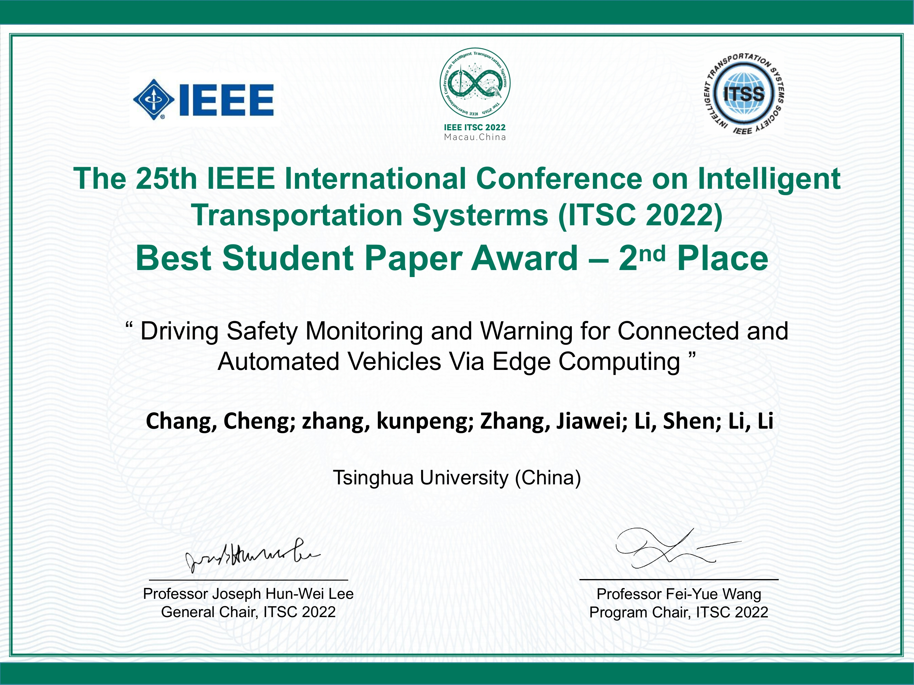

## The flowchart of the proposed framework.


---

## Best Student Paper Award


---


## Citation
If you find our work is useful in your research, please consider citing:
```
@INPROCEEDINGS{9922076,
  author={Chang, Cheng and Zhang, Kunpeng and Zhang, Jiawei and Li, Shen and Li, Li},
  booktitle={2022 IEEE 25th International Conference on Intelligent Transportation Systems (ITSC)}, 
  title={Driving Safety Monitoring and Warning for Connected and Automated Vehicles via Edge Computing}, 
  year={2022},
  volume={},
  number={},
  pages={3940-3947},
  doi={10.1109/ITSC55140.2022.9922076}}

```

