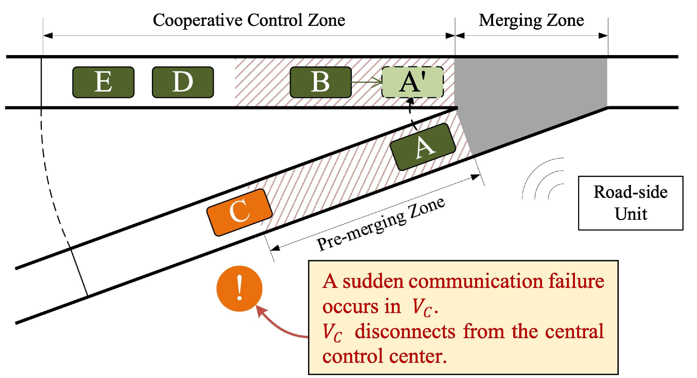
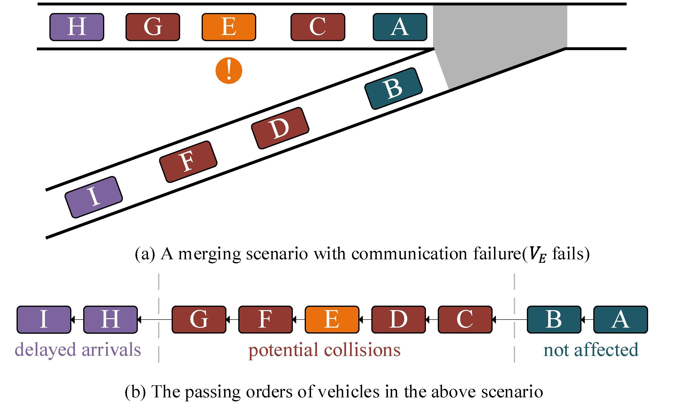
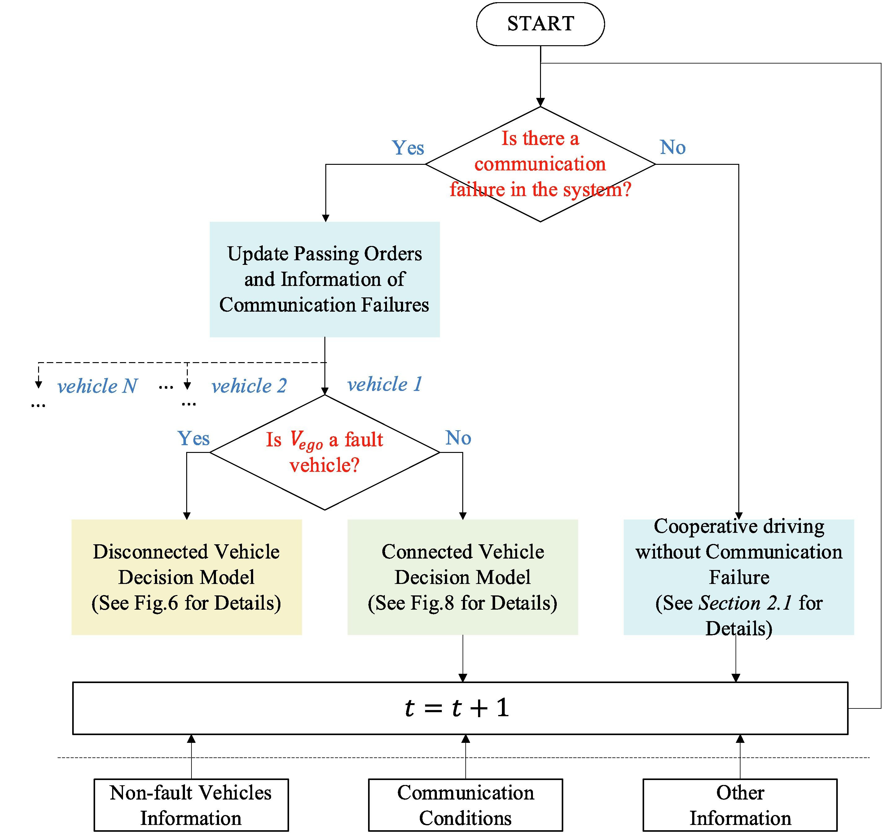
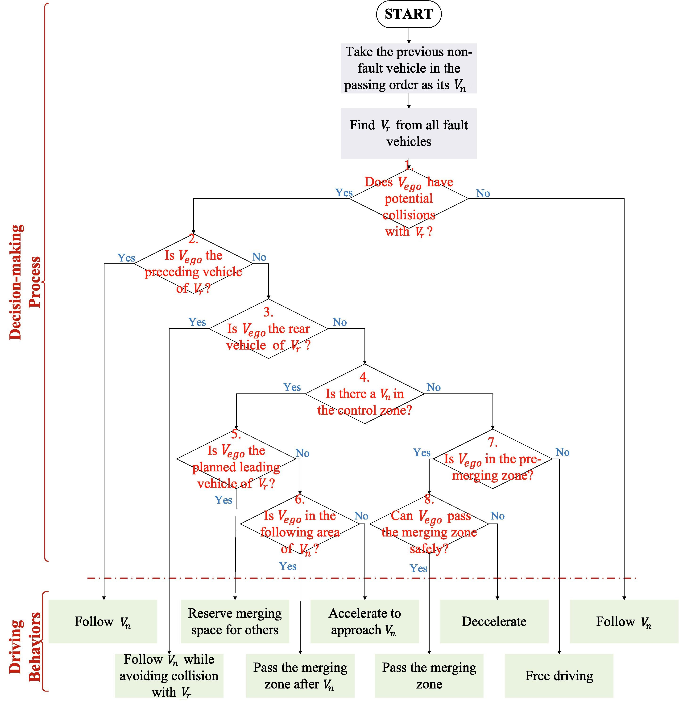

 *详细内容请参阅[论文](https://www.sciencedirect.com/science/article/pii/S0968090X23002164?via%3Dihub)原文*
 
A typical highway on-ramp scenario with communication failures.


The classification of vehicles in a merging scenario with communication failure.


---
The flowchart of the fault-tolerant cooperative driving model.


---
The flowchart of the connected vehicle decision model.



## Citation
If you find our work is useful in your research, please consider citing:
```
@article{LIU2023104227,
	title = {Fault-Tolerant cooperative driving at highway on-ramps considering communication failure},
	journal = {Transportation Research Part C: Emerging Technologies},
	volume = {153},
	pages = {104227},
	year = {2023},
	issn = {0968-090X},
	doi = {https://doi.org/10.1016/j.trc.2023.104227}
}
```

