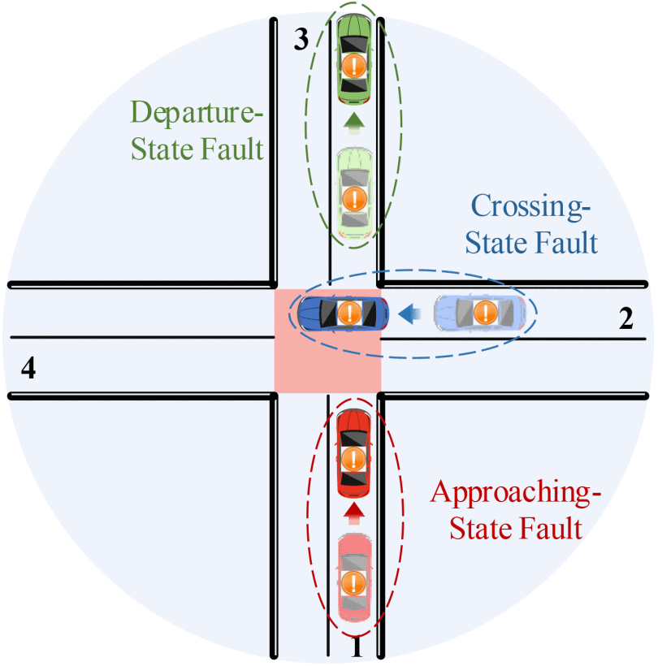
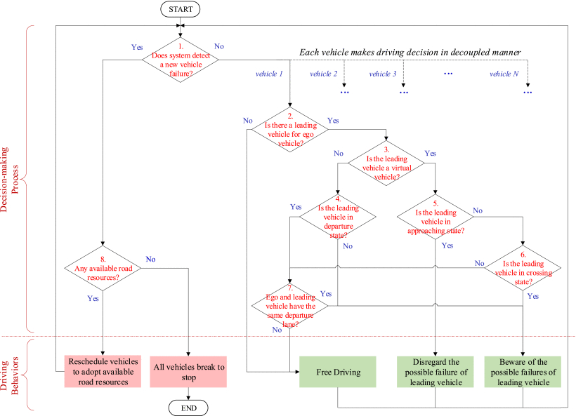

#### Potential vehicle failures are divided into three categories.


---
#### Eight-step fault-tolerant cooperative driving model. Challenge 1 is addressed in Step 2-7, and challenge 2 is addressed in Step 1 and Step 8.



## Citation
If you find our work is useful in your research, please consider citing:
```
@ARTICLE{9735412,
  author={Pei, Huaxin and Zhang, Jiawei and Zhang, Yi and Pei, Xin and Feng, Shuo and Li, Li},
  journal={IEEE Transactions on Intelligent Vehicles}, 
  title={Fault-Tolerant Cooperative Driving at Signal-Free Intersections}, 
  year={2023},
  volume={8},
  number={1},
  pages={121-134},
  doi={10.1109/TIV.2022.3159088}
}
```

