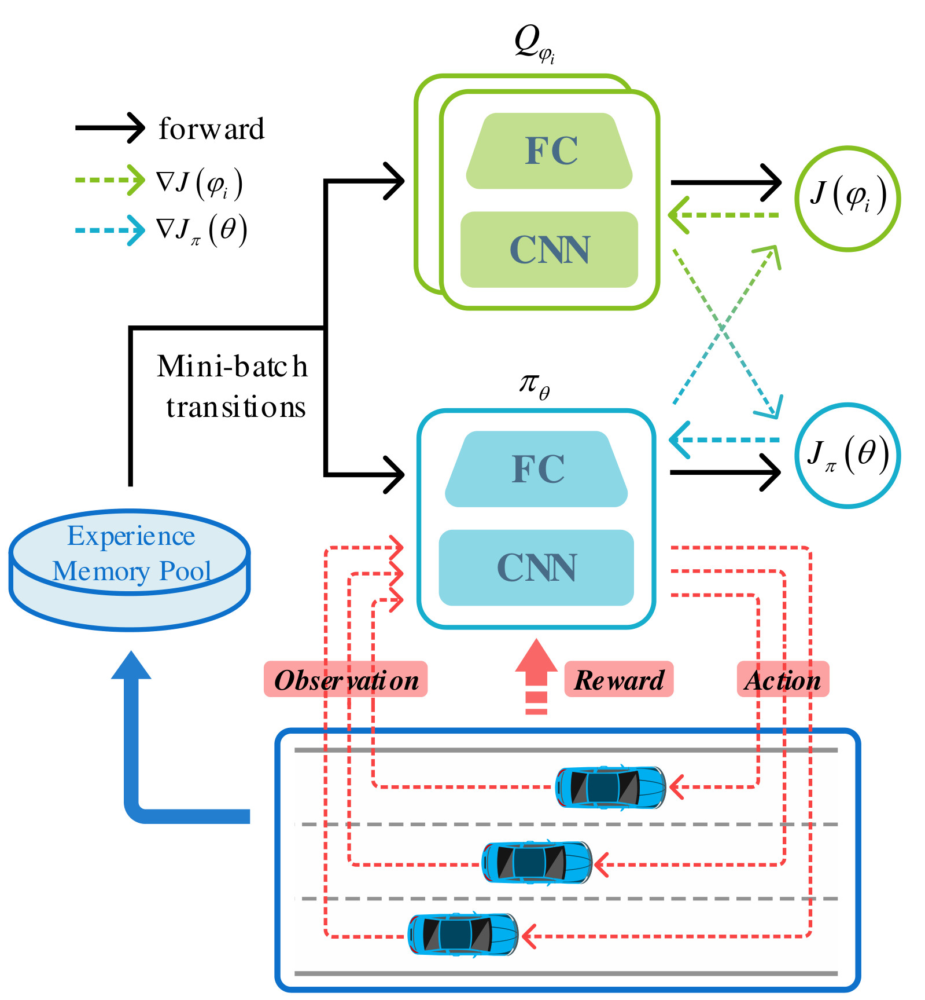
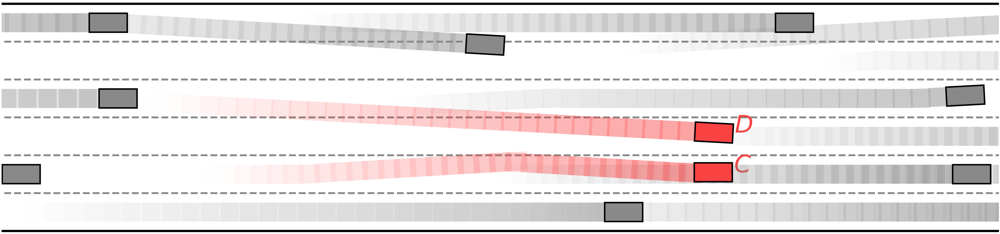

## The overall architecture of the proposed bi-level lane-change behavior planning strategy.


## An illustration of the traffic snapshot and driving intention.


## The training pipeline of the upper-level SAC based lane-change decision model.



# Performance

#### Average speed of traffic flow under different lane-change decision models. The baseline denotes that lane changes are not allowed and all vehicles keep the lanes.


#### Screenshot of the traffic simulation, where we enable only the upper-level lane-change decision model but do not enable the lower-level right-ofway assignment model. *Vehicle A* and *Vehicle B* collide during executing the lane-change actions.


#### Screenshot of traffic simulation with the proposed bi-level lanechange behavior planning strategy. The lower-level right-of-way assignment model avoids the potential collision between *Vehicle C* and *Vehicle D*.



#### Vehicle trajectories in congested traffic with different lane-change decision models. The upper subfigure is from the model that only considers ego benefits, and the lower subfigure is from the proposed model.


## Citation
If you find our work is useful in your research, please consider citing:
```
@ARTICLE{9932003,
  author={Zhang, Jiawei and Chang, Cheng and Zeng, Xianlin and Li, Li},
  journal={IEEE Transactions on Intelligent Transportation Systems}, 
  title={Multi-Agent DRL-Based Lane Change With Right-of-Way Collaboration Awareness}, 
  year={2023},
  volume={24},
  number={1},
  pages={854-869},
  doi={10.1109/TITS.2022.3216288}
}
```

