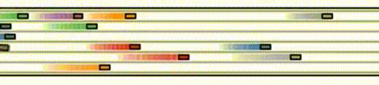

 *下面为本研究的简要介绍，详细内容请参阅[论文](https://ieeexplore.ieee.org/abstract/document/9932003)原文*


**双层换道决策规划框架**。核心思想是将换道行为规划分解为两个子规划问题：上层换道决策问题和下层路权分配问题。上层模型决定是否变道，旨在获得更好的驾驶条件。下层模型在换道的过程中合理分配路权，旨在保证变道行为的安全性。

---


**BEV状态表征和驾驶意图标准**。（*Upper*）交通快照. 交通快照是以Ego车辆为参考的二维占用栅格。对于车辆占用的网格，其值设置为1；否则，该值被设置为0。（*Lower*）驾驶意图. 驾驶意图旨在表征周围车辆的未来驾驶行为，目的是使Ego车辆在做出换道决策时能够考虑周围车辆的驾驶行为，从而提供车辆之间就路权进行协商的可能性。为了使编码简洁，同时又不丢失必要的信息，我们构造了一个与交通快照矩阵大小相同的矩阵来对预测的轨迹进行编码。需要注意的是，由于所有车辆都在向前移动，我们对预测的轨迹进行了简单的平移预处理，以便用于编码的轨迹相对于Ego车辆。这为Ego车辆提供了周围车辆通行权需求的明确特征，避免了深度强化学习智能体进行硬抽象。这种编码方法是通用的。它不受周围车辆数量和道路几何形状的限制，可以很容易地部署到所有车辆上。

---
$R_4=\min \left(0, w_4 * \frac{v_{\text {after }}^{\text {follow }}-v_{\text {before }}^{\text {follow }}}{v_{\text {exp }}^{\text {follow }}}\right)$

**考虑换道行为对周围车辆影响的奖励函数**。

---


**多智能体换道决策训练算法**。在本文中，我们重点研究变道行为的多智能体特性，旨在学习一种能够实现车辆之间交互和协作的变道决策模型。为此，我们将强化学习算法SAC扩展到我们的基于多智能体的车道变更决策问题中。相比于其他强化学习算法，SAC算法大大提高了采样效率，并在许多问题上取得了最先进的性能。我们使用集中学习和分布式执行的训练模式。

---


**性能评估——效率**. 我们计算了不同到达率下车辆的平均速度，结果上图所示。结果表明，该模型在不同到达速率下都能达到最大平均速度，显著提高了出行效率。传统的基于深度强化学习的模型只考虑Ego车辆的收益（即没有R_4的模型），导致模型具有竞争性。在交通效率方面几乎没有提高。经典的MOBIL模型没有考虑车辆之间的协作，导致整体交通效率的提高有限。如Table III中的变道频率所示，主要原因是仅考虑自我利益会导致以自我为中心的换道决策模型，从而导致全局交通效率低下。此外，驾驶意图使每辆车在做出变道决策时都能考虑到周围车辆的路权需求，从而促进车辆之间的协作，提高全局交通效率（*更多讨论见原文第IV-C节*）。随着到达率的增加，即交通密度的增加，驾驶意图对提高交通效率的影响变得更加显著。研究表明，在拥堵的交通中，车辆之间的互动会更加频繁。在做出变道决策时考虑周围车辆的驾驶意图，将显著提高全局交通效率。


---


**性能评估——安全**. 上图显示了不同换道决策模型下的碰撞率。结果表明，本研究提出的模型在所有到达率下都能实现较低的碰撞率，提高了变道决策模型的安全性。随着到达率的增加，车辆之间的交互变得更加频繁。不考虑驾驶意图的模型（即无意图模型和MOBIL模型）会导致越来越高的碰撞率。相反，所提出的模型的碰撞率总是处于较低的值。此外，没有R4的模型只考虑自我利益，导致了高风险的竞争性变道决策模型。Table III所示的变道频率结果也验证了这一点。没有R4的模型和没有意图的模型的变道次数明显高于所提出的模型。需要注意的是，尽管我们的模型仍然存在碰撞，但下面的的实验分析将表明，这些罕见碰撞的责任不在于变道决策模型，且可以通过较低级别的路权分配模型有效避免。

---


**模型评估——奖励范式**。为了证明所提出的多智能体DRL奖励范式在变道决策问题上的优越性，我们比较了两种全局奖励范式。一种是广泛使用的直接全局奖励范式，其中奖励函数具有与全局流量条件相关的周期性奖励项。在这里，我们设置了一个与交通流平均速度相关的全局奖励项目，而单步奖励仍然是*R1+R2+R3*。另一种是本文提出的间接全局奖励范式，即我们使用*R4*来间接发挥全局奖励的作用。我们在相同的环境中训练这两个模型。上图显示了模型训练过程中，单步奖励、平均速度、碰撞率的结果。奖励值曲线表明，本文提出的模型具有更好的训练稳定性，并且关于自我利益的奖励值大于具有直接全局奖励的模型。另一方面，具有*R4*的模型具有更高的平均速度和更低的碰撞率，即，所提出的间接全局奖励范式在单个车辆和交通上都具有更好的性能。因此，上述结果表明，由于交通系统的特殊性，及时且有区别的奖励项目有利于训练基于多智能体DRL的变道决策模型。相反，直接全局奖励具有严重的延迟，并且不能区分不同智能体行为的优点，这不利于基于多智能体DRL的变道决策模型的训练。

---


**模型评估——奖励函数**。奖励项*R4*的大小决定了变道决策模型在多大程度上考虑了变道行为对交通的影响，并在我们的奖励函数中发挥着关键作用。我们设置不同的*w4*并训练相应的模型。上图结果表明，仅考虑Ego车辆（*w4=0*）性能的模型将导致激进的换道策略。变道行为的频率较高，而全球交通效率较低。然而，过度考虑变道影响（*w4=12*）将导致保守的换道政策。变道行为的比例和全球交通效率都很低。具有适当R4（*w4=4，8*）的模型将平衡个体利益与全局利益，从而最大限度地提高整个系统的效率。

---


**模型评估——观测空间**。这里探讨不同观测信息对所提出的换道决策模型的影响。上图显示了奖励值和平均速度随学习过程的结果。奖励曲线表明，具有所有观测信息的模型获得了更大、更稳定的奖励曲线。没有交通状况的模型将导致不稳定的学习过程。交通流的平均速度曲线表明，具有所有观测信息的模型将具有更大的平均速度。因此，所提出的所有三种类型的观测信息都对变道决策模型的性能有显著贡献。

---


**驾驶意图的作用**。在这里，我们分析了驾驶意图如何对所提出的换道决策模型的协作性能做出贡献。我们采用不同的模型对10000个测试场景进行变道决策，结果如表IV所示。同时，我们可视化了两个决策结果不同的变道场景，如上下图所示。首先，上图显示了驾驶意图将变道动作转变为保持车道动作。该模型基于三帧交通快照发现左侧车道是空闲的，并因此输出向左侧车道改变动作。然而，驾驶意图显示后方车辆正在向左变道。因此，所提出的模型输出车道保持动作，避免了与后方车辆争夺路权，并使后方车辆能够实现其所需的车道变换效益。在这里，驾驶意图使车辆之间能够隐含地协商路权，使车辆在做出变道决策时能够考虑周围车辆的路权需求。同时，所学习的模型通常基于先到先得原则做出变道决策，这是一种与人类驾驶员相似的和谐而明确的决策逻辑。 如表IV所示，驾驶意图将高达80.6%（841/1043）的变道行为转化为车道保持行为，避免了大量可能导致路权竞争或冲突的变道行动。这是驾驶意图提高所提出的变道决策模型的协同性能的主要方式。

其次，下图显示了驾驶意图将车道保持动作转变为变道动作。无意图的模型基于交通快照输出车道保持动作。然而，驾驶意图表明右车道中的前方车辆相对于自身车辆正在加速。所提出的模型输出的向右变道动作可以产生更大的效率增益。这表明驾驶意图促进了有限路权的更有效利用，进一步提高了整个交通系统的效率。表IV显示，这种类型的变道动作占所有变道动作的38.2%（125/327），是驾驶意图增强变道决策模型协同性能的另一种关键方式。


---


**潜在碰撞分析**。在这里，我们研究碰撞场景，且利用本文提出的双层变道行为规划策略来避免碰撞。上图1显示了变道决策模型时的一个典型碰撞场景。车辆A和车辆B几乎同时基于所提出的决策模型做出变道决策。车辆A决定换到右侧车道。根据截图，A车的决定是合理的，因为A车的右侧车道没有车辆，同时周围的车辆也无意占用该车道。同样，车辆B的决定，即改变到左侧车道，也是合理的。然而，在执行变道动作的过程中，车辆A和车辆B发生碰撞，因为我们强制所有车辆完全执行变道操作。
然后，我们启用了底层的基于协商的路权分配模型。图2显示了与图1类似的场景，其中车辆C和车辆D同时并入同一目标车道。在执行变道动作期间，车辆C和车辆D协商通行权。车辆C合理让出路权并停止并线，避免了潜在的碰撞，同时使车辆D能够实现其期望的变道动作。我们对双层变道行为规划方法进行了全面的模拟测试。结果表明，较低级别的路权分配模型可以完全避免碰撞，确保车道变更行为的安全性。


---


**驾驶意图对变道成功率的影响**。我们在相同的下层路权分配模型设置下（碰撞率为0）部署了不同的上层变道决策模型，分别是所提出的有意图模型和无意图模型。在不同的交通条件下，我们统计了变道动作执行的成功率，即车辆成功并入目标车道的比率，结果如上图所示。结果表明，有意图模型的成功率明显高于无意向模型，并且随着交通密度的增加，成功率的提高更为显著。在拥堵交通条件下（900 veh/（lane*h）），变道成功率提高了12.2%。这表明考虑到周围车辆驾驶意图的模型可以做出更和谐、更安全的变道决策。因此，再次表明，驾驶意图可以促进模型在做出变道决策时合理考虑周围车辆的路权需求，避免可能导致路权竞争或冲突的变道行为，并提高变道决策模型的路权协作意识。

---


**基于意图协商的分布式自主决策涌现出宏观群体协同智能**。最后，我们展示了所提出的模型对较长和拥堵的高速公路上的交通流的贡献。具体来说，我们模拟了一条有6条车道和3000米长的高速公路，到达率为900veh/（lane*h）。在跑了4min后，我们模拟了1500米附近发生的交通事故。在交通事故附近，所有车道上的车辆速度均降至0，60秒后重新开放交通。为了直观地显示交通流的性能，我们绘制了所提出的模型和仅考虑自我利益的模型的3车道上车辆的时空轨迹。结果表明，当交通事故发生在拥堵的公路交通中时，仅考虑自身利益的变道模型会导致交通堵塞在大范围内继续蔓延，最终导致整个道路的交通堵塞。相反，所提出的变道模型可以快速消除事故引起的交通堵塞波，避免交通堵塞的持续传播。同时，恢复的交通流表明，该模型可以更好地利用道路资源，实现更高效、更顺畅的交通流。本质上，这种性能主要是因为所提出的模型考虑了车辆之间的路权协作，这大大促进了车辆的同步。此外，车辆的微观同步导致交通流的宏观同步，这对于在拥挤的交通条件下实现良好的性能至关重要。


---

**仿真视频**




---


## Citation
If you find our work is useful in your research, please consider citing:
```
@ARTICLE{9932003,
  author={Zhang, Jiawei and Chang, Cheng and Zeng, Xianlin and Li, Li},
  journal={IEEE Transactions on Intelligent Transportation Systems}, 
  title={Multi-Agent DRL-Based Lane Change With Right-of-Way Collaboration Awareness}, 
  year={2023},
  volume={24},
  number={1},
  pages={854-869},
  doi={10.1109/TITS.2022.3216288}
}
```

