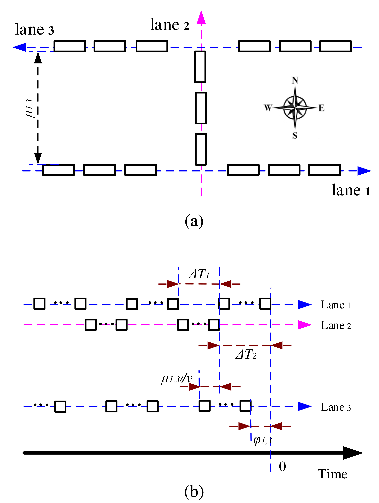

#### Illustration of different control methods at the simplest conflict point, where vehicles run in only two directions.
(a) rhythmic control, where vehicles pass with the one-by-one zipper-style movement; (b) modular vehicles control, where vehicles condense the car-following gap or even diminish such gap to increase the intersection capacity; (c) platoon-based control, where vehicles in the same direction are grouped to pass the intersection, but there is a gap between vehicles in the same group.


---
#### Illustration of the condensing process before cooperative driving at the core area of an unsignalized intersection.


---
#### Three-lane intersection with two west-to-east flow lanes and one south-to-north flow lane.


---
#### Fig.5
(a) Three-lane intersection with one west-to-east flow lane, one east-to-north flow lane, and one south-to-north flow lane; (b) the corresponding right-of-way assignments along the time axis.



---
#### Eight-lane intersection with four through lanes first labeled as counterclockwise and four left-turn lanes then labeled as counterclockwise.


## Citation
If you find our work is useful in your research, please consider citing:
```
@ARTICLE{10225295,
  author={Li, Shen and Zhang, Jiawei and Chen, Zhenwu and Li, Li},
  journal={Tsinghua Science and Technology}, 
  title={Theoretical Analysis of Cooperative Driving at Idealized Unsignalized Intersections}, 
  year={2024},
  volume={29},
  number={1},
  pages={257-270},
  doi={10.26599/TST.2022.9010069}
}
```

